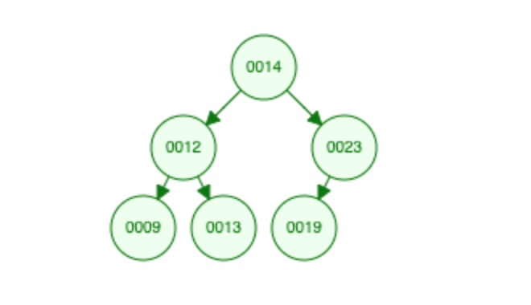
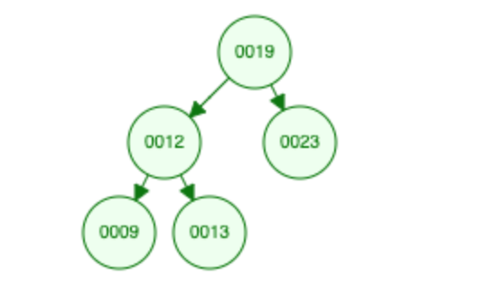

# JavaScript - Browser - Binary Search Tree

## What is this?

This is runnable demonstration of a Binary Search Tree data structure written in browser compatible JavaScript.

## Why make this?

To help reinforce the learning of the Binary Search Tree (BST).

## How do I use this?

- Read overview
- Read / Rewrite the javascript
	- If you rewrote place a reference to it in the `index.html`
- Open the `index.html` file browser
- Open the console
- Observe the output

## Binary Search Tree Overview

### What is a Binary Search Tree

A Binary Search Tree (BST) is a data strcuture (like a list or a map) which allows for finding items more quickly than linear searches. A BST is composed of Nodes, a Node is a strcuture which itself has a value and a reference to two other Nodes. The other Nodes are refered to as a `left` and a `right` Node, sometime called "child" Nodes. A BST has a `root` Node which is no Node's child. The simplest valid Tree is a Tree which contains a single / `root` Node.

### How do I add an item (Node) to a Tree?

Items are added to the tree by a very simple traversal algorithim. First you make a new node which holds the value you want in the tree. Then you traverse the tree looking for where your new Node fits. Each time you encounter a Node (starting with the root) you inspect it by asking the following questions: 

1. Is the value in my new Node the same as the value in the Node I am presently inspecting?
	- If the answer is yes generally speaking we abandon the process as the tree already has the value you need
2. Is the value in my new Node greater than the value in the Node I am presently inspecting?
	- If the answer is yes you ask if the Node has a right child
	- If it does NOT then your new Node has found its home as the right child of the Node you are presently inspecting
	- If it does have a value then begin the process back at step one using the right child as the Node to inspect
3. Is the value in my new Node less than the value in the Node I am presently inspecting?
	- If the answer is yes you ask if the Node has a left child
	- If it does NOT then your new Node has found its home as the left child of the Node you are presently inspecting
	- If it does have a value then begin the process back at step one using the left child as the Node to inspect 

By repeating this process you will always have a tree whose "right-most" value is the highest value and the "left-most" value is the lowest value.

### How do I find an item (Node) in a Tree?

Finding is a simple matter of repeating the process described in adding. Traverse the tree and at each Node ask if the Node under inspection matches the value you are looking for and if it does return the Node, if not ask if the value is higher or lower than the value you are looking for and inspect on the right node for higher and on the left node for lower. Repeat the the process until the Node you are looking for is found or no more Nodes are left to inspect.

### How do I delete a Node?

Node deletion is the trickiest part of dealing with a BST. There are four possible situations you can find yourself in and we will discuss each of them. As with both adding and finding Nodes in a Tree the first job is to reach the Node you would like to delete, for more on this process see adding or finding Nodes section of this article. As an aside, how you deal with a situation where no Node matches the value is up to you, but generally I return a boolean from a remove function indicating whether or not a Node with the value in question was deleted. As mentioned earlier, there are four possible situations you can find yourself in once you have reached the Node you'd like to delete. I will discuss them in order; from simplest to most complex.

1. The Node slated for deletion has no children
	- Set the Node to null (delete it)
2. The Node slated for deletion has a left child Node but no right child Node
	- Get the value from the left child Node and replace the value for the Node slated for deletion with that value  
	- Set the left child Node to null (delete it)
3. The Node slated for deletion has a right child Node but no left child Node
	- Get the value from the right child Node and replace the value for the Node slated for deletion with that value  
	- Set the right child Node to null (delete it)
4. The Node slated for deletion has both a right and left child
	- This operation is where nearly all of the complexity surrounding binary search trees occurs and thusly will have a slightly longer section explaining it.

#### Deleting A Node That Has a Left and Right Child

Before going any further let's make sure we understand the problem as it stands. We have a Tree and we want to remove a Node. However the Node we want to remove has a sub-Tree all of its own. How do we remove the Node without breaking the ordering of the tree structure and without accidentally creating any orphan Nodes.

The answer is that we want to replace the value at the Node slated for deletion with the value from the "left-most" child of the right child of the Node slated for deletion (refered to as Solution A). 

Equally valid is the mirror of that solution which is to reaplce the value in the Node slated for deletion with the "right-most" child of the left child of the Node slated for delettion.

I know that that is a mouthful, but we will try to explain it in words. To maintain the Tree's order we want any child on the right to be greater than its parent and any Node on the left to be less than its parent. If we take the first solution (Solution A) and put it in practice we might get a tree that looks like this:

In the Tree above let's attempt to remove `0014` it has two children `0012` and `0023`. We cannot simply promote the Node's containing the values `0012` or `0023` since they in turn have children whose values need to respected in order for the tree to remain balanced. Solution A states that we take the "left-most" child of the right child of the Node slated for deletion and promote that value to the Node whose current value is `0014`. 

Let's attempt to see what that Tree looks like. Recall the Node for deletion is `0014` if we look at the right child of `0014` we see `0023`. Now, we are going to search for `0023`'s "left-most" child an replace `0014` with it. In this case the "left-most" child is easily found to be `0019`

Let's remove the current `0019` Node and place the value `0019` where the `0014` currently sits. The Tree now looks like this.

This tree is valid!

You will find the same concept holds true if you reverse the logic and take the "right-most" child of the left child of the Node slated for deletion.

### What are some real worls uses for the Tree data strcuture?

 Here's what [StackOverflow](https://stackoverflow.com/questions/2130416/what-are-the-applications-of-binary-trees#targetText=Binary%20search%20trees%20are%20used%20to%20implement%20set%20and%20map.&targetText=One%20of%20the%20most%20important,AVL%20trees) says about it.

## Resources

- https://www.cs.usfca.edu/~galles/visualization/BST.html
- https://www.youtube.com/watch?v=5cU1ILGy6dM
- https://www.youtube.com/watch?v=nOcFiGl5Vy4